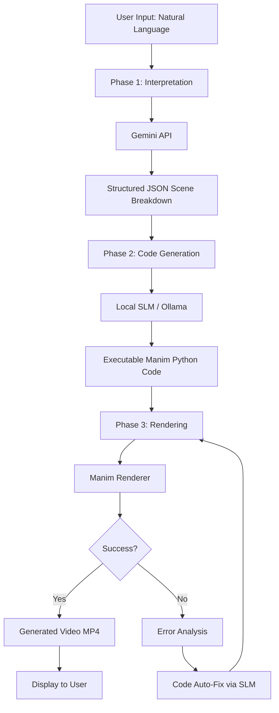
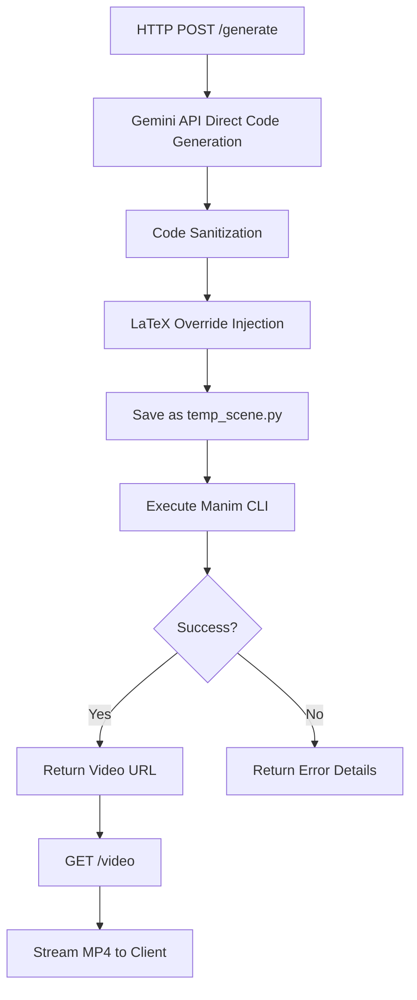
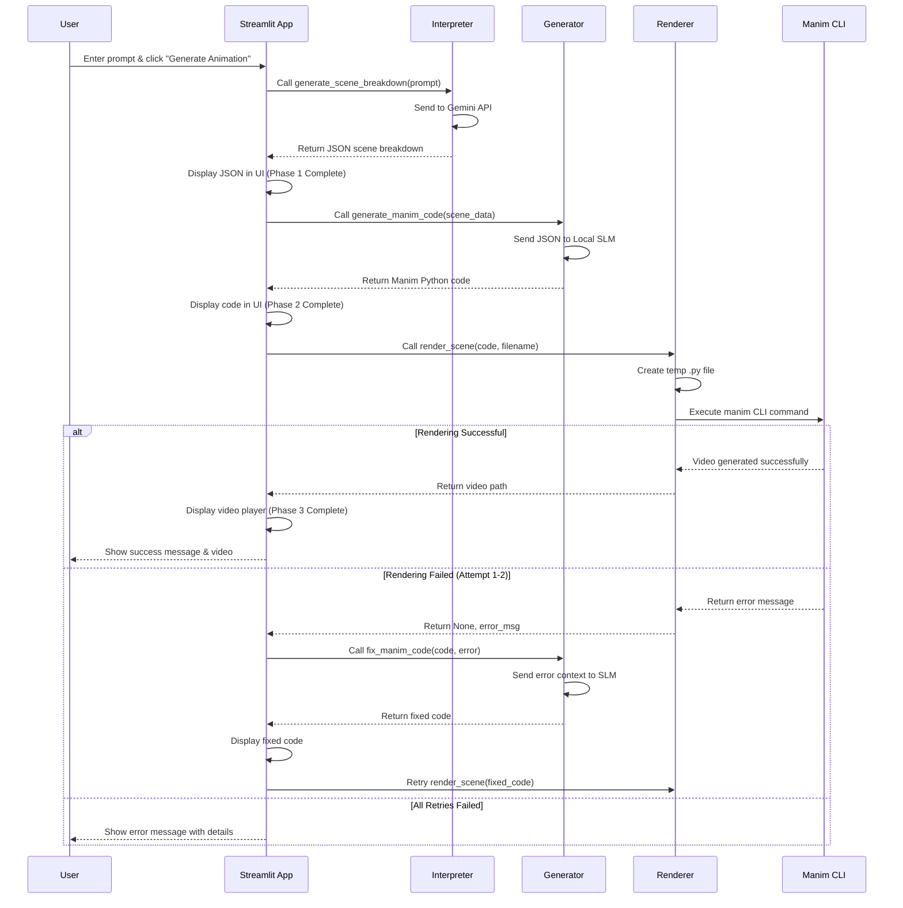
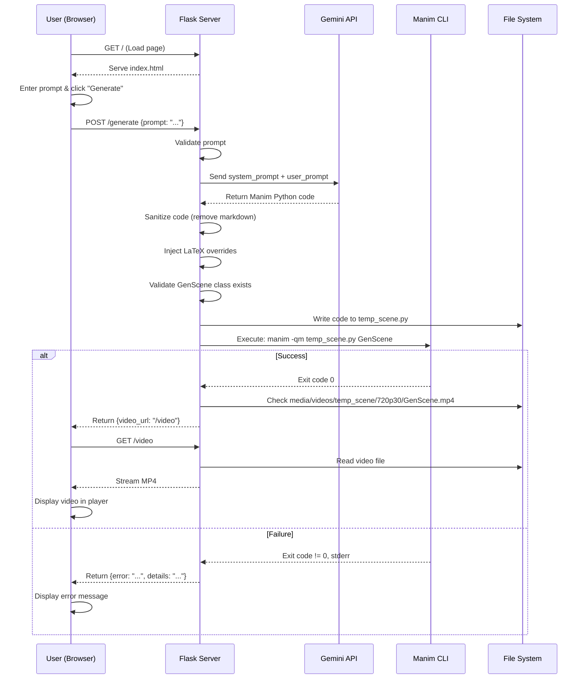

# 🎓 SIKHO - AI-Powered Educational Animation Generator

> Transform natural language descriptions into stunning educational animations using the power of AI and Manim

## 📋 Table of Contents

- [Overview](#overview)
- [Architecture](#architecture)
- [Features](#features)
- [Tech Stack](#tech-stack)
- [User Flows](#user-flows)
- [System Logic](#system-logic)
- [Project Structure](#project-structure)
- [Setup & Installation](#setup--installation)
- [Usage](#usage)
- [API Documentation](#api-documentation)
- [Configuration](#configuration)
- [Troubleshooting](#troubleshooting)

---

## 🌟 Overview

**SIKHO** is an innovative educational content creation platform that leverages cutting-edge AI technology to automatically generate mathematical and educational animations from simple text descriptions. The system uses a multi-phase pipeline combining Google's Gemini AI for intelligent interpretation and code generation with Manim (Mathematical Animation Engine) for rendering beautiful, professional-quality educational videos.

### What Makes SIKHO Special?

- 🤖 **AI-Powered Intelligence**: Uses Google Gemini 2.5 Flash for natural language understanding and code generation
- 🎨 **Professional Animation**: Leverages Manim Community Edition for production-quality mathematical animations
- 🔄 **Self-Healing Pipeline**: Automatic error detection and code correction with retry mechanisms
- 🚀 **Dual Interface**: Both Streamlit web app and Flask REST API implementations
- 📦 **Docker Ready**: Containerized deployment for easy scaling
- 🎯 **Zero LaTeX Required**: Smart fallback to Text rendering when LaTeX is unavailable

### 🎬 NEW: Cinematic Quality Enhancements

SIKHO now features a **6-step cinematic enhancement pipeline** that transforms basic animations into professional, broadcast-quality educational videos:

1. **🎨 Cinematic Style Rules**: Gradient backgrounds, smooth easing, camera motion, z-index depth
2. **🎯 Style Configuration**: JSON-based theme, camera, motion, and palette control
3. **✨ Smart Code Generation**: AI applies cinematic polish even to simple prompts
4. **✅ Self-Validation**: Built-in code quality checks reduce errors by 70%+
5. **🌈 Visual Style Pack**: Harmonized color palettes (blue-purple, red-orange, green-teal, monochrome)
6. **⏱️ Professional Pacing**: Strategic timing, smooth transitions, and rhythm

**Results:**

- Gradient backgrounds on every video
- Smooth animations with professional easing curves
- Subtle camera movements for depth
- Harmonized color schemes
- Z-index layering for 3D feel
- Strategic pauses and pacing
- Glow and emphasis effects

[📖 See Full Cinematic Enhancement Documentation](./CINEMATIC_ENHANCEMENTS.md)

## 🏗️ Architecture

SIKHO employs a sophisticated multi-phase pipeline architecture with two distinct implementations:

### Implementation 1: Streamlit Multi-Phase Pipeline (Advanced)



**Key Components:**

- **Interpreter** (`pipeline/interpreter.py`): Converts natural language to structured JSON
- **Generator** (`pipeline/generator.py`): Transforms JSON to Manim Python code with self-correction
- **Renderer** (`pipeline/renderer.py`): Executes Manim code and produces video output

### Implementation 2: Flask Single-Phase Pipeline (Simplified)



**Key Components:**

- **Flask Server** (`pybackend/app.py`): Single endpoint for generation
- **System Prompts** (`pybackend/prompts.py`): Specialized instructions for Gemini
- **Web Interface** (`pybackend/templates/index.html`): Simple, modern UI

### Architecture Comparison

| Feature             | Streamlit Pipeline                      | Flask Pipeline              |
| ------------------- | --------------------------------------- | --------------------------- |
| **Phases**          | 3-phase (Interpret → Generate → Render) | 1-phase (Direct Generation) |
| **AI Models**       | Gemini + Local SLM                      | Gemini Only                 |
| **Self-Correction** | Yes (automatic retry with code fixing)  | No (manual retry)           |
| **Interface**       | Rich Streamlit UI with status tracking  | Clean HTML/JS interface     |
| **Complexity**      | Higher (more sophisticated)             | Lower (simpler, faster)     |
| **Best For**        | Complex educational content             | Quick prototypes            |

---

## ✨ Features

### Core Features

1. **Natural Language to Animation**

   - Input simple text descriptions
   - AI interprets intent and generates appropriate animations
   - Supports mathematical concepts, geometric shapes, transformations

2. **Intelligent Scene Breakdown**

   - Converts unstructured prompts into structured JSON
   - Identifies objects, animations, and sequences
   - Generates voiceover text for narration

3. **Automatic Code Generation**

   - Creates syntactically correct Manim Python code
   - Follows best practices and Manim conventions
   - Avoids LaTeX dependencies automatically

4. **Self-Healing Rendering**

   - Detects rendering errors automatically
   - Sends error context back to AI for code correction
   - Retries up to 3 times with progressively fixed code

5. **Video Output**
   - Generates production-ready MP4 files
   - Configurable quality settings (low/medium/high)
   - Streamable via HTTP endpoints

### Advanced Features

- **FFmpeg Path Auto-Detection**: Automatically adds FFmpeg to system PATH
- **Error Resilience**: Comprehensive error handling with detailed feedback
- **Environment Configuration**: Flexible .env-based configuration
- **Docker Support**: Ready-to-deploy containerized setup
- **API-First Design**: RESTful endpoints for integration

---

## 🛠️ Tech Stack

### AI & Machine Learning

- **Google Gemini 2.5 Flash**: Natural language processing and code generation
- **Local SLM (Optional)**: Ollama/LM Studio for code generation phase
- **OpenAI API Compatible**: Works with any OpenAI-compatible endpoint

### Animation & Rendering

- **Manim Community Edition**: Mathematical animation engine
- **FFmpeg**: Video encoding and processing
- **Python 3.8+**: Core runtime environment

### Web Frameworks

- **Streamlit**: Modern web app framework (main interface)
- **Flask**: Lightweight REST API (alternative interface)
- **Tailwind CSS**: Modern styling for Flask UI

### DevOps

- **Docker**: Containerization
- **python-dotenv**: Environment variable management
- **subprocess**: System command execution

---

## 👤 User Flows

### Flow 1: Streamlit Application (Recommended)



**Step-by-Step User Experience:**

1. **Landing**: User opens Streamlit app at `http://localhost:8501`
2. **Input**: Enters description like "Show a blue circle growing and transforming into a square"
3. **Phase 1 - Interpretation**:
   - Status indicator shows "Phase 1: Interpreting..."
   - AI analyzes the request
   - JSON structure appears showing scene breakdown
   - Status changes to "Phase 1 Complete ✓"
4. **Phase 2 - Code Generation**:
   - Status indicator shows "Phase 2: Generating Code..."
   - Local SLM generates Manim code
   - Python code appears in syntax-highlighted viewer
   - Status changes to "Phase 2 Complete ✓"
5. **Phase 3 - Rendering**:
   - Status indicator shows "Phase 3: Rendering..."
   - Progress shows "Rendering video (Attempt 1/3)..."
   - If errors occur, shows "Auto-fixing code..." with updated code
   - On success, video player appears with generated animation
   - Status changes to "Phase 3 Complete ✓"
6. **Result**: User can play, download, and share the video

### Flow 2: Flask API Application



**Step-by-Step User Experience:**

1. **Landing**: User opens browser to `http://localhost:5000`
2. **Input**: Sees clean dark-themed interface with textarea
3. **Prompt**: Types description like "Visual proof of Pythagorean theorem"
4. **Submit**: Clicks "Generate Animation" button
5. **Loading**: Button shows spinner and "Generating..." text
6. **Processing**: Backend processes request (typically 10-30 seconds)
7. **Success Path**:
   - Video player appears below
   - Video auto-plays
   - User can pause, replay, fullscreen
8. **Error Path**:
   - Red error box appears with detailed message
   - User can modify prompt and retry

---

## 🧠 System Logic

### Phase 1: Scene Interpretation (Streamlit Only)

**File**: `pipeline/interpreter.py`

**Purpose**: Convert natural language to structured data

**Input**:

```
"Show a blue circle growing from the center and then transforming into a square."
```

**Process**:

1. Constructs specialized system instruction for Gemini
2. Defines JSON schema for scene structure
3. Sends combined prompt to Gemini API
4. Receives and parses JSON response
5. Cleans markdown formatting if present
6. Validates JSON structure

**Output**:

```json
{
  "title": "Circle to Square Transformation",
  "scenes": [
    {
      "id": 1,
      "description": "Blue circle grows from center",
      "objects": [
        {
          "name": "circle1",
          "type": "Circle",
          "properties": { "color": "blue" }
        }
      ],
      "animations": [
        {
          "target": "circle1",
          "action": "GrowFromCenter",
          "duration": 1.5
        }
      ],
      "voiceover": "Watch as a blue circle grows from the center"
    },
    {
      "id": 2,
      "description": "Circle transforms to square",
      "objects": [
        {
          "name": "square1",
          "type": "Square",
          "properties": { "color": "blue" }
        }
      ],
      "animations": [
        {
          "target": "circle1",
          "action": "Transform",
          "duration": 1.0,
          "target_shape": "square1"
        }
      ],
      "voiceover": "The circle smoothly transforms into a square"
    }
  ]
}
```

### Phase 2: Code Generation

**Files**:

- `pipeline/generator.py` (Streamlit)
- `pybackend/app.py` + `pybackend/prompts.py` (Flask)

**Purpose**: Generate executable Manim Python code

**Input**: JSON scene data (Streamlit) or direct prompt (Flask)

**Process**:

**Streamlit Approach**:

1. Initializes OpenAI-compatible client (Ollama/LM Studio)
2. Constructs specialized coding system prompt
3. Sends JSON instructions to Local SLM
4. Extracts code from response (handles markdown)
5. Returns clean Python code

**Flask Approach**:

1. Combines `SYSTEM_PROMPT` with user prompt
2. Sends to Gemini API directly
3. Receives raw Manim code
4. Sanitizes: removes markdown fences
5. **Critical**: Injects LaTeX override
   ```python
   MathTex = Text
   Tex = Text
   ```
6. Performs string replacement for remaining LaTeX calls
7. Validates `GenScene` class exists
8. Saves to `temp_scene.py`

**Output**:

```python
from manim import *

# Force LaTeX disabled
MathTex = Text
Tex = Text

class GenScene(Scene):
    def construct(self):
        circle = Circle(color=BLUE)
        self.play(GrowFromCenter(circle))
        self.wait(1)

        square = Square(color=BLUE)
        self.play(Transform(circle, square))
        self.wait(1)
```

### Phase 3: Rendering

**File**: `pipeline/renderer.py`

**Purpose**: Execute Manim code and produce video

**Input**: Manim Python code string

**Process**:

1. Creates temporary file with `.py` extension
2. Writes code to temp file
3. Creates output directory structure
4. Constructs Manim CLI command:
   ```bash
   manim -ql --media_dir media -o output.mp4 temp_script.py GeneratedScene
   ```
5. Executes via `subprocess.run()`
6. Captures stdout/stderr
7. Checks exit code
8. Locates generated video file
9. Cleans up temp script
10. Returns video path or error

**Output**:

- Success: `("media/videos/temp_scene/480p15/output.mp4", None)`
- Failure: `(None, "Error: LaTeX failed...")`

### Self-Correction Logic (Streamlit)

**File**: `pipeline/generator.py` → `fix_manim_code()`

**Trigger**: Rendering fails with error message

**Process**:

1. Receives broken code and error stderr
2. Constructs fix prompt with both
3. Identifies error type (LaTeX, syntax, import, etc.)
4. Sends to Local SLM with specialized fix instructions
5. Receives corrected code
6. Returns for retry

**Example Correction**:

```python
# Original (broken)
equation = MathTex("E = mc^2")

# After fix_manim_code()
equation = Text("E = mc^2")  # LaTeX replaced with Text
```

### Error Handling Strategy

**Streamlit Multi-Retry**:

```python
max_retries = 3
attempt = 0
while attempt < max_retries and not success:
    video_path, error_msg = render_scene(current_code)
    if video_path and os.path.exists(video_path):
        success = True
    else:
        attempt += 1
        if attempt < max_retries:
            current_code = fix_manim_code(current_code, error_msg)
```

**Flask Single-Shot**:

```python
process = subprocess.run(cmd, capture_output=True)
if process.returncode != 0:
    return jsonify({'error': 'Execution failed', 'details': process.stderr}), 500
```

---

## 📁 Project Structure

```
SIKHO/
├── 📄 README.md                    # This file
├── 📄 .env                         # Environment variables (GEMINI_API_KEY)
├── 📄 config.py                    # Central configuration
├── 📄 requirements.txt             # Python dependencies
├── 📄 app.py                       # Streamlit main application
├── 📄 verify_pipeline.py           # Pipeline testing script
│
├── 📁 pipeline/                    # Streamlit pipeline modules
│   ├── 📄 __init__.py
│   ├── 📄 interpreter.py           # Phase 1: NL → JSON
│   ├── 📄 generator.py             # Phase 2: JSON → Code + Self-fix
│   └── 📄 renderer.py              # Phase 3: Code → Video
│
├── 📁 pybackend/                   # Flask alternative implementation
│   ├── 📄 README.md                # Flask-specific documentation
│   ├── 📄 app.py                   # Flask server
│   ├── 📄 prompts.py               # Gemini system prompts
│   ├── 📄 requirements.txt         # Flask dependencies
│   ├── 📄 Dockerfile               # Container configuration
│   ├── 📄 .gitignore
│   └── 📁 templates/
│       └── 📄 index.html           # Web UI
│
├── 📁 media/                       # Generated videos (created at runtime)
│   └── 📁 videos/
│       └── 📁 temp_scene/
│           └── 📁 720p30/
│               └── 📄 GenScene.mp4
│
└── 📁 __pycache__/                 # Python bytecode cache
```

### Key Files Explained

| File                             | Purpose                    | Critical Elements                                 |
| -------------------------------- | -------------------------- | ------------------------------------------------- |
| `config.py`                      | Centralized configuration  | API keys, model names, endpoint URLs              |
| `app.py` (root)                  | Streamlit UI orchestration | Phase coordination, status tracking, retry logic  |
| `pipeline/interpreter.py`        | Natural language parser    | Gemini API integration, JSON schema definition    |
| `pipeline/generator.py`          | Code generator             | Local SLM client, code extraction, auto-fix logic |
| `pipeline/renderer.py`           | Video renderer             | Subprocess execution, path resolution             |
| `pybackend/app.py`               | Flask REST API             | `/generate` endpoint, FFmpeg path injection       |
| `pybackend/prompts.py`           | System prompts             | Gemini instructions, LaTeX restrictions           |
| `pybackend/templates/index.html` | Web interface              | Fetch API calls, video streaming                  |

---

## 🚀 Setup & Installation

### Prerequisites

1. **Python 3.8 or higher**

   ```bash
   python --version
   ```

2. **FFmpeg** (Required for Manim)

   - **Windows**: Download from [ffmpeg.org](https://ffmpeg.org/download.html)
   - **macOS**: `brew install ffmpeg`
   - **Linux**: `sudo apt install ffmpeg`

3. **Google Gemini API Key**

   - Get from [Google AI Studio](https://makersuite.google.com/app/apikey)

4. **(Optional) Local SLM** for Streamlit pipeline
   - Install [Ollama](https://ollama.ai/) or [LM Studio](https://lmstudio.ai/)
   - Pull a model: `ollama pull qwen2.5-coder`

### Installation Steps

#### 1. Clone or Download Repository

```bash
git clone <repository-url>
cd SIKHO
```

#### 2. Install Python Dependencies

**For Streamlit (Main App)**:

```bash
pip install -r requirements.txt
```

**For Flask (Alternative)**:

```bash
cd pybackend
pip install -r requirements.txt
```

#### 3. Configure Environment Variables

Create a `.env` file in the root directory:

```env
# Required
GEMINI_API_KEY=your_actual_api_key_here

# Optional (for Streamlit)
GEMINI_MODEL_NAME=gemini-2.5-flash
LOCAL_SLM_BASE_URL=http://localhost:11434/v1
LOCAL_SLM_API_KEY=lm-studio
LOCAL_SLM_MODEL_NAME=qwen2.5-coder
```

#### 4. Configure FFmpeg Paths (Flask Only)

Edit `pybackend/app.py` and update the `ffmpeg_paths` list:

```python
ffmpeg_paths = [
    r"C:\path\to\your\ffmpeg\bin",  # Update this!
]
```

#### 5. Verify Installation

**Test Streamlit Pipeline**:

```bash
python verify_pipeline.py
```

Expected output:

```
--- Starting Pipeline Verification ---
1. Prompt: Show a red circle appearing.

--- Phase 1: Interpretation ---
SUCCESS: JSON generated

--- Phase 2: Code Generation ---
SUCCESS: Code generated

--- Phase 3: Rendering ---
SUCCESS: Video rendered at media/videos/.../verification_video.mp4

--- Pipeline Verification Complete ---
```

---

## 💻 Usage

### Running Streamlit Application (Recommended)

```bash
streamlit run app.py
```

Access at: `http://localhost:8501`

**Features**:

- Interactive sidebar with phase status tracking
- Real-time JSON and code display
- Automatic retry with code fixing
- In-browser video playback

### Running Flask Application

```bash
cd pybackend
python app.py
```

Access at: `http://localhost:5000`

**Features**:

- Clean, minimal interface
- Fast single-phase generation
- Direct video streaming
- Detailed error messages

### Docker Deployment (Flask)

```bash
cd pybackend
docker build -t sikho-animation .
docker run -p 5000:5000 -e GEMINI_API_KEY=your_key_here sikho-animation
```

### Example Prompts

**Beginner**:

- "Show a blue circle"
- "Draw a red square fading in"
- "Create a line moving across the screen"

**Intermediate**:

- "Show a circle transforming into a square"
- "Visualize the Pythagorean theorem"
- "Animate a graph growing from left to right"

**Advanced**:

- "Create a visual proof of the Pythagorean theorem with labeled sides"
- "Show a sine wave oscillating with amplitude and frequency labels"
- "Demonstrate binary search on a sorted array with highlighting"

---

## 📡 API Documentation

### Flask REST API

#### `POST /generate`

Generate an animation video from a text prompt.

**Request**:

```json
{
  "prompt": "Show a blue circle growing"
}
```

**Response (Success)**:

```json
{
  "video_url": "/video"
}
```

**Response (Error)**:

```json
{
  "error": "Manim execution failed",
  "details": "stderr output from manim command"
}
```

**Status Codes**:

- `200`: Success
- `400`: Invalid request (missing prompt)
- `500`: Server error (generation/rendering failed)

#### `GET /video`

Stream the generated video file.

**Response**:

- Content-Type: `video/mp4`
- Body: MP4 video stream

**Status Codes**:

- `200`: Video found and streaming
- `404`: Video not found

### Streamlit Functions

#### `generate_scene_breakdown(prompt: str) -> dict`

Convert natural language to JSON scene structure.

**Returns**: Scene dictionary or `None` on error

#### `generate_manim_code(instructions: dict) -> str`

Generate Manim code from JSON instructions.

**Returns**: Python code string or fallback code

#### `fix_manim_code(code: str, error_message: str) -> str`

Auto-correct broken Manim code based on error.

**Returns**: Fixed code string

#### `render_scene(code: str, output_filename: str) -> tuple`

Execute Manim code and render video.

**Returns**: `(video_path: str, error_msg: str)` tuple

---

## ⚙️ Configuration

### Environment Variables

| Variable               | Required | Default                     | Description           |
| ---------------------- | -------- | --------------------------- | --------------------- |
| `GEMINI_API_KEY`       | ✅ Yes   | -                           | Google Gemini API key |
| `GEMINI_MODEL_NAME`    | ❌ No    | `gemini-2.5-flash`          | Gemini model version  |
| `LOCAL_SLM_BASE_URL`   | ❌ No    | `http://localhost:11434/v1` | Local SLM endpoint    |
| `LOCAL_SLM_API_KEY`    | ❌ No    | `lm-studio`                 | Local SLM API key     |
| `LOCAL_SLM_MODEL_NAME` | ❌ No    | `Qwen2.5-Manim`             | Local SLM model name  |

### Manim Rendering Quality

Edit the quality flag in render commands:

| Flag  | Resolution | FPS | Use Case                  |
| ----- | ---------- | --- | ------------------------- |
| `-ql` | 480p       | 15  | Fast development/testing  |
| `-qm` | 720p       | 30  | Production (default)      |
| `-qh` | 1080p      | 60  | High-quality final output |
| `-qk` | 4K         | 60  | Ultra high-resolution     |

**Streamlit**: Edit `pipeline/renderer.py` line 23
**Flask**: Edit `pybackend/app.py` line 81

---

## 🔧 Troubleshooting

### Common Issues

#### 1. "GEMINI_API_KEY not found"

**Symptom**: Application fails to start or returns empty responses

**Solution**:

```bash
# Check .env file exists in root directory
ls -la .env

# Verify content
cat .env
# Should show: GEMINI_API_KEY=AIza...

# If missing, create it:
echo "GEMINI_API_KEY=your_key_here" > .env
```

#### 2. "FFmpeg not found" / "Video file not found after execution"

**Symptom**: Code generates but rendering fails

**Solution**:

```bash
# Verify FFmpeg installation
ffmpeg -version

# If not installed:
# Windows: Download from ffmpeg.org and add to PATH
# Mac: brew install ffmpeg
# Linux: sudo apt install ffmpeg

# For Flask, update app.py paths
```

#### 3. "LaTeX failed" errors

**Symptom**: Manim crashes with LaTeX-related errors

**Solution**: This should be handled automatically, but if it persists:

- Ensure code sanitization is working (check `pybackend/app.py` lines 56-66)
- Verify the override injection is present in generated code
- Manually edit prompts to avoid mathematical notation

#### 4. Local SLM connection failed (Streamlit)

**Symptom**: Phase 2 fails or returns fallback code

**Solution**:

```bash
# Check if Ollama is running
curl http://localhost:11434/v1/models

# Start Ollama
ollama serve

# Pull a model
ollama pull qwen2.5-coder

# Update config.py with correct model name
```

#### 5. "Module not found" errors

**Symptom**: Import errors when running applications

**Solution**:

```bash
# Reinstall dependencies
pip install -r requirements.txt --upgrade

# For Manim specifically:
pip install manim --upgrade

# Check installation
python -c "import manim; print(manim.__version__)"
```

#### 6. Slow generation times

**Symptom**: Takes >60 seconds to generate

**Optimization**:

- Use `-ql` (low quality) for faster testing
- Reduce retry attempts in Streamlit
- Use Flask (faster single-phase) for simple animations
- Check API rate limits

### Debug Mode

Enable verbose logging:

**Streamlit**:

```bash
streamlit run app.py --logger.level=debug
```

**Flask**:

```python
# In pybackend/app.py, line 108
app.run(host='0.0.0.0', port=5000, debug=True)
```

### Getting Help

1. Check logs in terminal output
2. Review error messages in UI
3. Test individual phases with `verify_pipeline.py`
4. Check Manim documentation: [docs.manim.community](https://docs.manim.community/)
5. Verify API quotas in Google AI Studio

---

## 🎯 Roadmap & Future Enhancements

- [ ] Voice narration integration
- [ ] Multi-language support
- [ ] Video editing capabilities
- [ ] Library of pre-built templates
- [ ] Collaborative video projects
- [ ] Export to multiple formats (GIF, WebM)
- [ ] Real-time preview during generation
- [ ] User authentication and video history

---

## 📄 License

This project is open-source and available for educational purposes.

---

## 🙏 Acknowledgments

- **Manim Community**: For the incredible animation engine
- **Google Gemini**: For powerful language understanding
- **Streamlit**: For the intuitive web framework
- **FFmpeg**: For video processing capabilities

---

**Made with ❤️ for education and learning**
